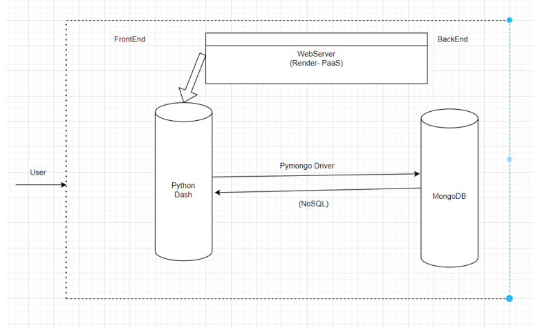

# Analysis of the Relationship between Macroeconomic Indicators and the Health/Energy Sectors 📈

## Team Members:
- Pendem Shiva Kumar
- Kambhampati Sai Madhav
- Cheeti Sricharan

## Section 1: Quick Links

- **Web App**: [Dashboard](https://dashboard-1.onrender.com/) (https://dashboard-1.onrender.com/)
  - **Credentials**:
    - Username: `hello`
    - Password: `world`

## Section 2: Project Overview

### Purpose:

The primary goal of this project is to delve deep into the relationship between macroeconomic indicators and the volatility of the health and energy sectors. By understanding these relationships, investors can make more informed decisions, diversifying their portfolios based on macroeconomic factors that historically impact these industries.

We focus on industry-specific ETFs, representing a group of companies from the same sector. Various models are employed to compute the volatility response variable, providing a comprehensive view of the industry's behavior in response to macroeconomic changes.
#### Click on the Image below to watch my video presentation 👆🏻

### How the Project is Built:

#### Web Application Architecture:

Our project encompasses:

1. **Data Storage**: Using MongoDB, we store data that's been sourced from Stooq.
2. **Backend**: Developed using Python.
3. **Visualization Dashboard**: Designed with Python Dash, it offers users an interactive experience with multiple dashboards. Bootstrap components from the Dash library enhance the visual appeal.
4. **Hosting**: Our application is hosted on Render, a reliable and free hosting platform.
5. **Interactivity**: Dash callback functions ensure a dynamic user experience.

### Dataset:

Our dataset, sourced from Stooq, includes macroeconomic indicators like inflation, unemployment, and GDP. It also contains stock price data for companies in the health and energy sectors, specifically Vanguard. This dataset was chosen for its relevance and quality, ensuring our analyses are based on accurate and comprehensive information.

### Functionalities:

- **Authentication**: Ensures only authorized users can access the Monitoring and Prediction Tabs.
- **Menu Panel**: Comprises two buttons - Monitoring and Prediction, directing users to their respective tabs.
- **Monitoring Tab**: Users can view the Macro-Indicator Graph and ETFs graph, with dropdown options to select various indicators and ETF prices.
- **Prediction Tab**: Employs the 'Random Forest Regression Model' for predicting outputs for VHT and VDE ETFs.

## Initial Plan:

1. Data storage in MongoDB.
2. Backend development using Python.
3. Visualization dashboard creation with Python Dash.
4. Hosting on Render.
5. Ensuring interactivity with Dash callback functions.
   

- **Initial Layout**: Users first see the Monitoring tab with Macro-Indicator and ETF graphs.
- **Menu Panel**: Contains Monitoring and Prediction buttons.
- **Tabs**: Two tabs - Monitoring and Prediction.
- **Color Scheme**: Palette with color `#f9ded7`.
- **Tab Displays**: 
  - **Monitoring Tab**: Macro-Indicator Graph and ETFs graph with interactive dropdown lists.
  - **Prediction Tab**: Graphs of predictions using various models.

---

